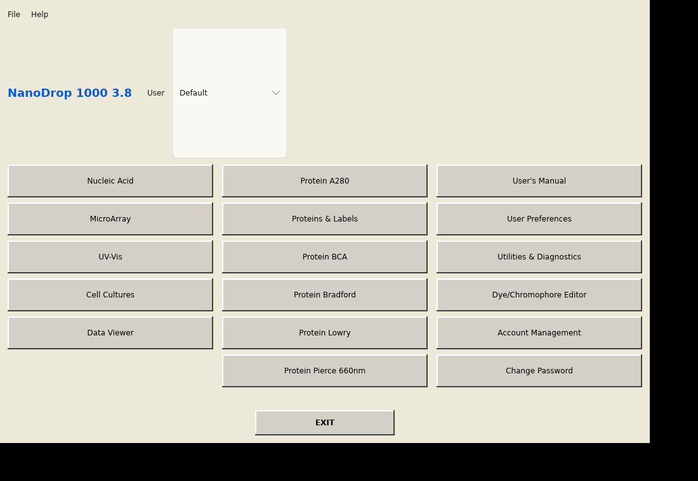
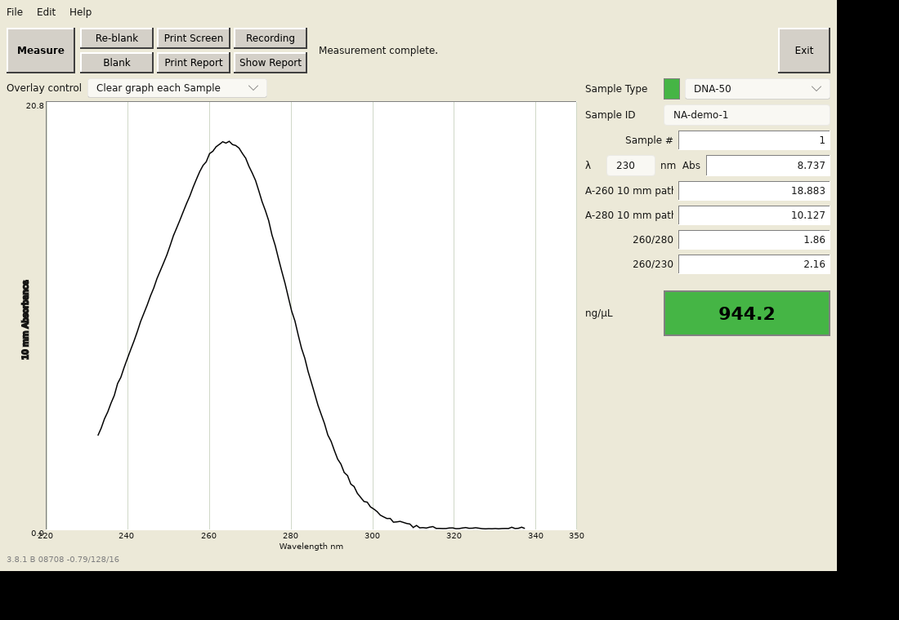

# OpenDrop

An open-source, cross-platform GUI to control the **NanoDrop ND-1000** microvolume UV-Vis spectrophotometer

**Still being developed**

## Screenshots

Current state; we will come up with a better user interface. Feature requests are welcome (use github issues)

### Main menu



### Nucleic Acid measurement



## Building & running

```sh
cargo run          # launch the GUI (mock backend)
cargo test         # run all tests
cargo clippy       # lint
```

### Using OpenDrop as a library

Disable default features to depend on the measurement/device/format code
without pulling in Slint:

```toml
[dependencies]
opendrop = { version = "0.1", default-features = false }
```

```rust
use opendrop::measure::{calc, Spectrum};
use opendrop::formats::read_archive;
```

## License

Licensed under MIT
