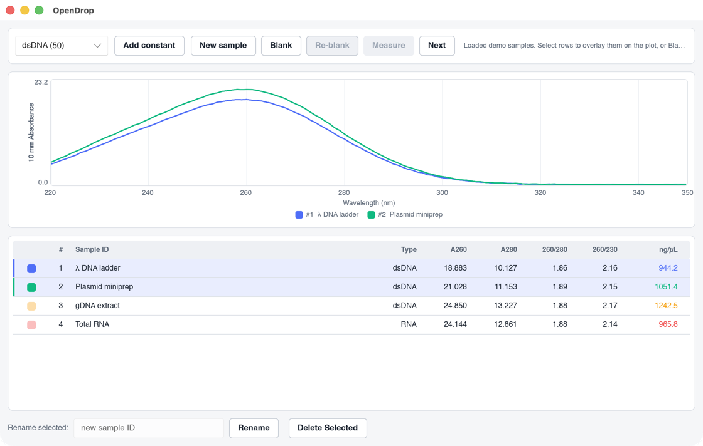

# OpenDrop

An open-source, cross-platform GUI to control the **NanoDrop ND-1000** microvolume UV-Vis spectrophotometer

**Still being developed**

## Screenshot

A single window: a measurement toolbar, an overlaid spectrum plot, and a table
of acquired samples. Select rows to overlay their spectra; export the plot and
table to PDF from the File menu. Feature requests are welcome (use github issues).



## Building & running

```sh
cargo run          # launch the GUI (mock backend)
cargo test         # run all tests
cargo clippy       # lint
```

### Using OpenDrop as a library

Disable default features to depend on the measurement/device/format code
without pulling in Slint:

```toml
[dependencies]
opendrop = { version = "0.1", default-features = false }
```

```rust
use opendrop::measure::{calc, Spectrum};
use opendrop::formats::read_archive;
```

## License

MIT license

Note that the code has been generated using agentic AI. Thus, before using reusing parts, please check
if the code has been directly copied from somewhere else
